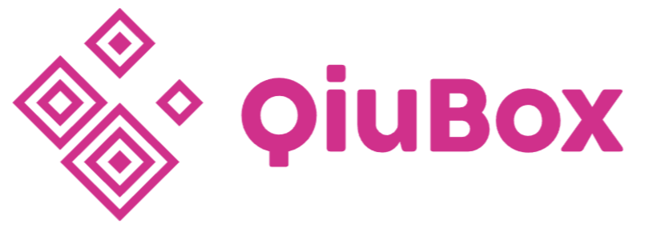

<!-- PROJECT LOGO -->
<br />
<div align="center">
  <a href="https://i.ibb.co/RYynbk5/Logo-Qiubox.png">
    
  </a>

  <h3 align="center">Qiubox Proyecto IronHack</h3>

  <p align="center">
    Tercer proyecto de Ironhack - Fullstack - MERN
    <br />
    <a href="https://nifty-beaver-2b28e7.netlify.app/"><strong>Ver trbajo:»</strong></a>
    <br />
    <br />
    <a href="https://github.com/RodrigoGonVaz/QiuBox-IH-BackEnd">Ver Backend</a>
    ·
    <a href="https://github.com/RodrigoGonVaz">Ver Github</a>
    ·
    <a href="https://twitter.com/MexaVerse">Twitter</a>
  </p>
</div>


<!-- TABLE OF CONTENTS -->
<details>
  <summary>Table of Contents</summary>
  <ol>
    <li>
      <a href="#about-the-project">Acerca del proyecto</a>
      <ul>
        <li><a href="#built-with">Lenguaje utilizado (MERN)</a></li>
      </ul>
    </li>
    <li>
      <a href="#getting-started">Inicio de proyecto</a>
      <ul>
        <li><a href="#prerequisites">Rutas de pagina</a></li>
        <li><a href="#installation">Dependencias</a></li>
      </ul>
    </li>
    <li><a href="#usage">CSS - Tailwind </a></li>
    <li><a href="#roadmap">Roadmap</a></li>
    <li><a href="#contributing">Contributing</a></li>
    <li><a href="#license">License</a></li>
    <li><a href="#contact">Contact</a></li>
    <li><a href="#acknowledgments">Acknowledgments</a></li>
  </ol>
</details>


<!-- ABOUT THE PROJECT -->
## Acerca del proyecto

[![Product Name Screen Shot][product-screenshot]](https://nifty-beaver-2b28e7.netlify.app/)

Este proyecto se hizo para el Bootcamp de Ironhack Oct-Dic 2021 de Web Dev. Recorriendo 3 módulos, se concluyo en construir una pagina web o desarrollo web con los conocimientos que se adquirieron durante 9 semanas. El proyecto se basa en una pagina demo donde los artesanos mexicanos puedan subir sus artesanías (CRUD) y poder venderlas, al igual esta disponible la venta de Cajas sorpresas o como se les conoce en el mercado (Mystery Box o Caja Secreta), esta caja contiene diferentes tipos de artesanías con la historia del artesano que la elaboro, pero hasta que llegue a tus manos podrás saber que hubo en la caja.

¿Que se aprendi en los modulos 1, 2 y 3?:
* Modulo 1 - FrontEnd se vio la integración de HTML, CSS y JavaScript en este modulo como proyecto se tuvo que elaborar un juego con CANVAS en JS. (https://mexaverse-doge-game.netlify.app)
* Modulo 2 - BackEnd se vio la integración de MongoDB con el Front y cómo elaborar Schemas y levantar servidores para trabajar Bases de Datos. El proyecto de este modulo trato de elaborar en equipo (Martin Giura) un desarrollo web que guardara los datos del cliente en una Base de datos cuando llenara formularios, editará o borrara algo desde la aplicación web. (http://www.mexaverse.co/)
* Modulo 3 - FullStack se vio la integración de modulo 1 con modulo 2 utilizando lo que se le conoce como MERN. Se aprendió a utilizar React.js y un poco de comercio electrónico, como Stripe. El proyecto final integra estos dos modulo y un poco de comercio electrónico. (https://nifty-beaver-2b28e7.netlify.app/)

MERN o MongoDB - Expresss - React - Node.js son las siglas para que se utilizan para sintetizar que tecnologías se utilizaron para la elaboración de un Desarrollo Web FullStack, que conecta el Front y el Backend.


<p align="right">(<a href="#top">back to top</a>)</p>


### Lenguaje utilizado

Aquí  encontraras un poco mas de información acerca de los lenguajes y tecnologías que se usaron para la elaboración de este ultimo proyecto. 

  
* [MongoDB](https://account.mongodb.com/)
* [Express](https://www.npmjs.com/package/express)
* [React.js](https://reactjs.org/)
* [Node.js](https://nodejs.org/en/)
* [Stripe](https://stripe.com/mx)
* [Tailwind](https://tailwindui.com/)

<p align="right">(<a href="#top">back to top</a>)</p>


<!-- GETTING STARTED -->
## Inicio de proyecto

Antes de empezar debes tomar en cuenta que se trabajo en una carpeta con dos archivos principales:
 
- El Backend o Server: https://github.com/RodrigoGonVaz/QiuBox-IH-BackEnd
- El Frontend o Client: https://github.com/RodrigoGonVaz/QiuBox-IH-FrontEnd

Estos dos archivos se encontraban en una misma carpeta para trabajarlos en conjunto.

Dentro del Backend se integro un .env con las siguientes claves:
- PORT=[Number]
- MONGODB_URI=["URL DE MONGO COMPASS O ATLAS"]
- SECRET=["UNA PALABRA SECRETA"]
- STRIPE_SK=["UNA KEY SECRETA QUE STRIPE TE DA PARA TEST"]

Dentro del Frontend se integro un .env con las siguientes claves:
- REACT_APP_BACKEND_URL=["El local host de tu PORT en backend - http://localhost:[Number]"]

## Prerequisites

Para iniciar el server o el backend se instalo un package.json
* npm
  ```sh
  npm install --y
  ```
Generando un package.json y package-lock.json

Para iniciar el client o el frontend se instalo React, el cual una vez instalado ya no es necesario hacerlo de nuevo (version 17)
* npx
  ```sh
  npx create-react-app .
  ```
Generando un los archivos necesarios para empezar a usar React.js

## Installation o Dependencias

_En la parte de abajo esta un ejemplo de las dependencias que deberas de instalar y como iniciar este proyecto para poder modificarlo o visualizarlo:_

### Backend o server:

1. Crea una carpeta para integrar los dos archivos principales (server/client)
2. Entra al github y haz un fork: [server](https://github.com/RodrigoGonVaz/QiuBox-IH-BackEnd) 
3. Clonna el repo
   ```sh
   git clone https://github.com/your_username_/Project-Name.git
   ```
4. Instala NPM packages
   ```sh
   npm install
   ```
5. Crea un archivo `.env` y escribe las variables de entorno:
    ```js
        PORT=[Number]
        MONGODB_URI=["URL DE MONGO COMPASS O ATLAS"]
        SECRET=["UNA PALABRA SECRETA"]
        STRIPE_SK=["UNA KEY SECRETA QUE STRIPE TE DA PARA TEST"]
   ```    
6. Verifica que las dependencias esten instaladas:
   ```js
    "bcryptjs"
    "cors"
    "dotenv"
    "express"
    "jsonwebtoken"
    "mongoose"
    "stripe"
   ```
7. Cambia el script del package.json
     ```js
        "scripts": {
    "test": "echo \"Error: no test specified\" && exit 1",
    "dev": "nodemon index.js",
    "start": "node index.js"
        },
   ```   
8. Levanta servidor y base de datos: (Debes de poder ver en terminal que se levanto con exito)
     ```js
        npm run dev
   ```    

### Frontend o client:

1. Dentro de la carpeta principal donde se clono el `server`
2. Entra al github y haz un fork: [client](https://github.com/RodrigoGonVaz/QiuBox-IH-FrontEnd) 
3. Clonna el repo dentro de la carpeta principal donde esta `server`
   ```sh
   git clone https://github.com/your_username_/Project-Name.git
   ```
4. Instala NPM packages
   ```sh
   npm install
   ```
5. Crea un archivo `.env` y escribe las variables de entorno:
    ```js
        REACT_APP_BACKEND_URL=["El local host de tu PORT en backend - http://localhost:[PORT]"]
   ```    
6. Verifica que las dependencias esten instaladas:
   ```js
    "@testing-library/jest-dom": "^5.16.1",
    "@testing-library/react": "^12.1.2",
    "@testing-library/user-event": "^13.5.0",
    "axios": "^0.24.0",
    "react": "^17.0.2",
    "react-dom": "^17.0.2",
    "react-router-dom": "^6.1.1",
    "react-scripts": "5.0.0",
    "web-vitals": "^2.1.2"
   ```  
7. Levanta client: (Debes de poder ver en terminal que se levanto con exito)
     ```js
        npm run start
   ``` 

<p align="right">(<a href="#top">back to top</a>)</p>


<!-- USAGE EXAMPLES -->
## CSS libreria - Tailwind

Es probable que Tailwind no se haya instalado correctamente por lo que recomiendo seguir las intrucciones en la siguiente liga.

_Si no ves diseño al hacer npm run start instala Tailwind [Documentation](https://tailwindcss.com/docs/guides/create-react-app)_

<p align="right">(<a href="#top">back to top</a>)</p>


<!-- CONTACT -->
## Contacto

Rodrigo Gonzalez - [@Mexaverse](https://twitter.com/MexaVerse) - rodrigogonvaz@gmail.com

Project Link: [Github Backend](https://github.com/RodrigoGonVaz/QiuBox-IH-BackEnd), [Github Frontend](https://github.com/RodrigoGonVaz/QiuBox-IH-FrontEnd), [Pagina Web](https://nifty-beaver-2b28e7.netlify.app/)

<p align="right">(<a href="#top">back to top</a>)</p>


<!-- ACKNOWLEDGMENTS -->
## Acknowledgments

Happy Coding! 🌮

* [IRONHACK MEXICO](https://www.ironhack.com/en/mexico-city)

- Qiubox Grande Imagen : https://i.ibb.co/0mfbyLt/Qiubox-Grande.pn

- Qiubox mediana Imagen :https://i.ibb.co/9TXpC5L/Qiubox-Mediana.png
- Qiubox chica Imagen: https://www.linkpicture.com/q/QiuboxChica.png
- Pan con cafe de hoya: https://i.ibb.co/Vt37v1J/IMG-3574.jpg

Colores de Qiubox (Paleta)
- Paleta de colores: http://www.colores.org.es/rosa-mexicano.php

- Background Login y signup: https://stock.adobe.com/es/images/mexico-cute-elements-vector-cartoon-seamless-pattern-on-a-white-background-for-wallpaper-wrapping-packing-and-backdrop/345527543?as_campaign=ftmigration2&as_channel=dpcft&as_campclass=brand&as_source=ft_web&as_camptype=acquisition&as_audience=users&as_content=closure_asset-detail-page

- Artesanos famoso: https://www.gob.mx/cultura/es/articulos/grandes-maestros-artesanos-los-artifices-de-la-identidad-cultural-de-mexico?idiom=es

- Template tailwind de Perfil Qiubox: https://tailwindcomponents.com/component/profile-page-2
- Template de landing page: https://easybank-web.vercel.app/#
- Otros templates que no se usaron: http://preview.graygrids.com/item/shine-tailwind-css-template/
- Otros: http://preview.graygrids.com/item/basic-tailwind-css-template/
- Otros: https://www.tailwindawesome.com/

- SVG catrina:  https://www.svgrepo.com/svg/285921/mexican-skull-skull
- SVG Heroicons: https://heroicons.com/

- URL Heroku Backend: https://qiubox.herokuapp.com/


- Crear producto en Stripe: https://stripe.com/docs/api/prices/create
- Inicio rapido Stripe: https://stripe.com/docs/checkout/quickstart